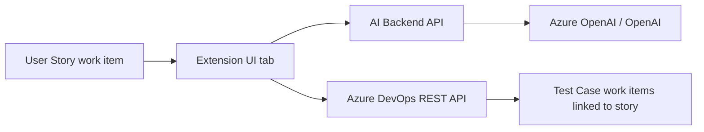

# AI Test Case Generator for Azure DevOps

An Azure DevOps extension that generates **Test Case** work items from **User Stories** using AI (Azure OpenAI or OpenAI). Comparable to marketplace offerings like [AI Test Case Generator](https://marketplace.visualstudio.com/search?term=Test%20case%20generator&target=AzureDevOps&category=Azure%20Boards&sortBy=Relevance), but fully under your control.

## Architecture



| Component | Role |
|-----------|------|
| `extension/` | React UI embedded in the User Story work item form |
| `backend/` | Node.js API that calls the LLM (keeps API keys off the client) |

## Prerequisites

- Node.js 18+
- Azure DevOps organization with **Test Case** work item type (Test Plans enabled)
- [Azure OpenAI](https://azure.microsoft.com/products/ai-services/openai-service) or OpenAI API key
- [Marketplace publisher](https://marketplace.visualstudio.com/manage) account (for publishing)
- [TFX CLI](https://github.com/microsoft/tfs-cli): `npm install -g tfx-cli`

## Quick start

### 1. Backend

```powershell
cd backend
copy .env.example .env
# Edit .env with your Azure OpenAI or OpenAI credentials
npm install
npm run dev
```

Verify: `http://localhost:3001/health` returns `{"status":"ok"}`.

Deploy to **Azure App Service**, **Azure Container Apps**, or similar. Production must use HTTPS.

### 2. Extension

```powershell
cd extension
npm install
npm run build
```

Add a 128×128 PNG at `extension/images/icon.png` (required for packaging).

Update `vss-extension.json`:

- Replace `YOUR_PUBLISHER_ID` with your Marketplace publisher ID
- Bump `version` for each release

### 3. Install locally (development)

```powershell
cd extension
tfx extension create --manifest-globs vss-extension.json
tfx extension install --vsix-path *.vsix --share-with YOUR_ORG
```

Or upload the `.vsix` via **Organization Settings → Extensions → Upload extension**.

### 4. Configure API URL

After install, open **Organization Settings → Extensions → AI Test Case Generator** and set **API Base URL** to your deployed backend (e.g. `https://your-api.azurewebsites.net`).

Alternatively, store the URL in extension data under key `apiBaseUrl` at organization scope.

### 5. Use it

1. Open a **User Story** work item in Azure Boards.
2. Open the **AI Test Cases** tab.
3. Click **Generate test cases**, review the preview, edit titles if needed.
4. Click **Create selected in Azure DevOps** — Test Cases are created and linked via **Tested By**.

## Marketplace publishing

1. Create a publisher at [Visual Studio Marketplace](https://marketplace.visualstudio.com/manage).
2. Prepare assets:
   - 128×128 icon (`images/icon.png`)
   - Screenshots (recommended 1366×768)
   - Privacy policy URL (required if you process customer data)
   - Support URL / contact
3. Package and publish:

```powershell
cd extension
npm run package
tfx extension publish --vsix-path *.vsix --publisher YOUR_PUBLISHER_ID --share-with YOUR_ORG
```

4. Submit for **public** listing via the Marketplace manage portal when ready.

### Licensing models (competitive context)

| Model | Examples on Marketplace |
|-------|-------------------------|
| Free | LambdaTest AI Test Manager, Work Item AI Generator |
| Free trial | AI Test Case Generator (Bake), BrowserStack Test Management |
| Paid | Vorsam Work Item Generator |

You can start **private/free** for your org, then add trials or paid tiers via Marketplace billing later.

## Security notes

- Never embed OpenAI keys in the extension bundle — always use the backend.
- Restrict `ALLOWED_ORIGINS` in production to your Azure DevOps org URL.
- Consider Azure AD auth on the backend for production.
- Review Microsoft’s [extension validation](https://learn.microsoft.com/en-us/azure/devops/extend/publish/overview) requirements.

## Customization ideas

- Support **Product Backlog Item** / **Requirement** work item types (adjust manifest constraints).
- Add Gherkin/BDD output format (like BDD Test Case Builder).
- Bulk generation from a query or sprint backlog.
- Azure OpenAI content filtering and audit logging.
- Integration with your Team360 delivery platform.

## Project structure

```
ado-ai-testcase-generator/
├── extension/
│   ├── vss-extension.json    # Manifest & contributions
│   ├── src/
│   │   ├── TestCaseGenerator.tsx
│   │   └── services/
│   │       ├── adoApi.ts     # Work item read/create
│   │       └── aiApi.ts      # Backend calls
│   └── images/icon.png       # Add before packaging
├── backend/
│   └── src/
│       ├── index.ts          # Express API
│       └── aiService.ts      # LLM prompts & parsing
└── README.md
```

## Troubleshooting

| Issue | Fix |
|-------|-----|
| Tab not visible | Confirm work item type is **User Story** (or relax manifest constraint). |
| API Base URL error | Set org extension configuration after install. |
| Test Case create fails | Ensure Test Plans is enabled and user has **Edit work items** + test permissions. |
| CORS errors | Set `ALLOWED_ORIGINS` on backend to your `dev.azure.com` org URL. |
| `UNABLE_TO_GET_ISSUER_CERT_LOCALLY` on `npm install` | Corporate SSL/proxy issue. **Option A (best):** ask IT for the corp root CA: `npm config set cafile "C:\path\to\corp-root-ca.pem"`. **Option B:** build in the cloud — push to GitHub and run the **Build ADO Extension VSIX** workflow (`.github/workflows/build-extension.yml`), then download the `.vsix` artifact. **Option C:** build on a personal PC or Azure VM outside the corp proxy. |

## Next steps

1. Add `extension/images/icon.png` and your publisher ID.
2. Deploy backend to Azure and set the API URL in the extension.
3. Test on a real User Story in your dev org.
4. Iterate on prompts in `backend/src/aiService.ts` for your domain (401k, compliance, etc.).
